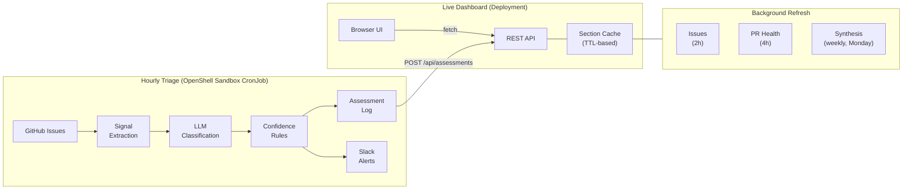
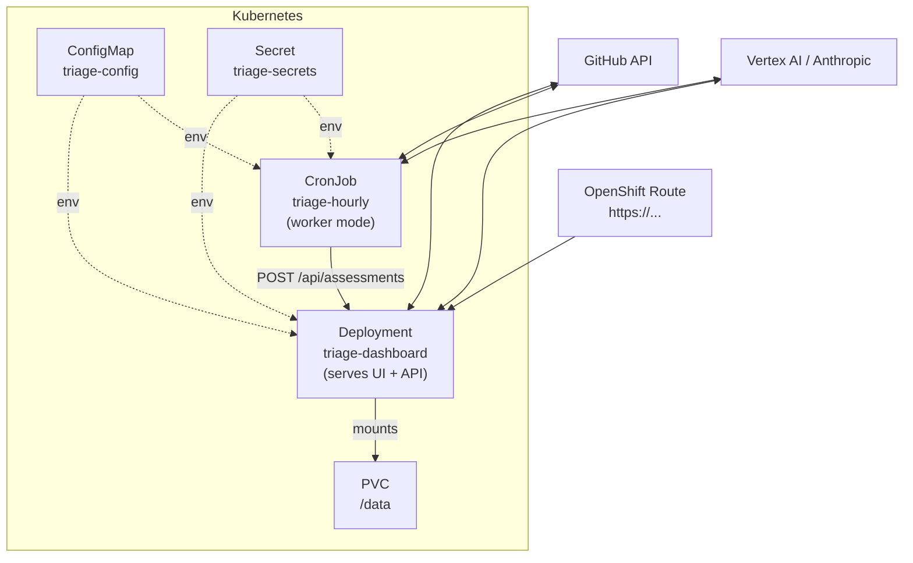

<div align="center">

# Team Issue Triage

**AI-powered issue triage agent that classifies, routes, and reports on GitHub issues across multiple teams.**

[]()
[]()
[]()
[]()

[Live Demo (stale: classification stopped Aug 2026, running pre-fix code)](https://triage-dashboard-team-issue-triage.apps.rosa.agent-ops.0lts.p3.openshiftapps.com) ·
[API Docs](#api-reference) ·
[Deploy Your Own](#deploy-to-kubernetes)

</div>

---

Point it at a GitHub repo and define your teams in YAML (built for NVIDIA/OpenShell; a few parts of the prompt are still OpenShell-specific, see Known limitations). The agent classifies every new issue to the right team, rates urgency, sends Slack alerts for critical items, and serves a live dashboard with cross-team analytics.

Built by Grace Smith during a Red Hat internship on the AI Agent Ops team, to help six Red Hat teams keep track of the NVIDIA OpenShell issue tracker.

## How It Works



**Triage pipeline** — each new issue gets one LLM call with all team descriptions, a routing table, and calibration examples. Confidence rules label every result (auto, multi-team or uncertain), route middling-confidence matches to no team, and add a low-confidence warning to Slack alerts so the receiving team knows to double-check.

**Dashboard** — API-first architecture with independently cached sections. Issues refresh every 2 hours, PR health every 4 hours. The team summaries on the dashboard are calculated directly from the data. The weekly LLM synthesis (Monday) still runs and is available at `/api/v1/report/synthesis`, but isn't displayed, because it was written from one time window and didn't match the dashboard's time filters. If GitHub goes down, the dashboard keeps serving cached data.


*Screenshot from September 2026. LLM classification stopped in late August when my internship credentials expired; the GitHub-based sections still refresh.*


## Schedule

| Component | Trigger | Frequency | Uses LLM? |
|-----------|---------|-----------|-----------|
| Issue triage | Hourly CronJob | Every hour (new issues only) | Yes — 1 call per new issue |
| Issues section refresh | Background thread | Every 2 hours | No — reads assessment log + GitHub API |
| PR health refresh | Background thread | Every 4 hours | No — GitHub API only |
| Vouch tracking refresh | Background thread | Every 4 hours | No — GitHub GraphQL only |
| Metrics refresh | Background thread | Every hour | No — computed from existing data |
| AI synthesis (API only, not displayed) | Background thread | Weekly (Monday, 9 UTC) | Yes — 1 call per team + 1 narrative call |
| Daily digest (optional, not in the default kustomization) | Digest CronJob | Daily (configurable) | No — formats existing triage results |

**Key distinction:** The LLM only runs during triage (classifying new issues) and during the weekly synthesis, whose output is only available through the API. Everything the dashboard displays, including the team summaries, is calculated directly from the data. All other refreshes — issues, PR health, vouch, metrics — are pure GitHub API reads and local computation. The dashboard can serve updated data every 2 hours without any LLM cost.


## OpenShell Sandbox

The triage worker (the hourly CronJob) runs inside an [OpenShell](https://github.com/NVIDIA/OpenShell) sandbox. OpenShell is a secure runtime that enforces a strict outbound network policy — the worker can only reach the services it actually needs:

| Allowed endpoint | Purpose |
|---|---|
| `api.github.com` | Fetch new issues |
| `inference.local` | LLM calls via the OpenShell gateway |
| `triage-dashboard` (in-cluster) | POST triage results to the dashboard API |
| `hooks.slack.com` | Send Slack alerts |

Nothing else — no other internet access, no access to other cluster services. The LLM key never enters the sandbox; inference goes through the OpenShell gateway at inference.local. The GitHub token and dashboard API token are passed in as environment variables.

The dashboard deployment runs outside the sandbox as a normal pod — it doesn't need the restriction because it only serves data it already has and refreshes from GitHub on a slow schedule.

## Features

| Feature | Description |
|---------|-------------|
| **Multi-team routing** | LLM classifies issues to N teams with confidence scores, multi-team flagging, and uncertainty detection |
| **Urgency rating** | Critical / high / medium / low |
| **Live dashboard** | KPIs, team routing, triage queue, PR health and contributor health. Area heatmap and duplicate detection are computed and available via the API and markdown report. |
| **PR health** | Open PR count, age distribution, neglected PRs, merge velocity |
| **Vouch tracking** | Pending/completed contributor vouches, blocked PRs, response times |
| **AI synthesis** | Per-team focus summaries, action items and executive narrative, generated weekly (Monday) by LLM. Runs weekly but isn't displayed on the dashboard (see Known limitations) |
| **Slack notifications** | Immediate alerts for critical/high issues, daily digest for medium/low |
| **Profile system** | YAML-based team definitions with areas, urgency overrides, few-shot examples, and notification config |
| **API-first** | All data available via REST API — integrate with Slack bots, CLI tools, CI pipelines, Grafana |
| **Multi-repo** | Issue fetching supports multiple repos; the dashboard, PR health and vouch tracking cover a single repo |

## Quick Start

```bash
git clone https://github.com/gracesmith6504/team-issue-triage.git
cd team-issue-triage
pip install -r requirements.txt
```

Set environment variables and run:

```bash
export GITHUB_TOKEN="ghp_..."
export LLM_PROVIDER="vertex"              # or "anthropic"
export VERTEX_PROJECT_ID="your-project"   # for Vertex AI
export WATCH_REPOS="your-org/your-repo"

# Start the dashboard (serves cached data, runs background section refreshers)
# NOTE: this does NOT triage new issues — run --mode triage or deploy the CronJob for that
python -m app --mode serve
```

Open `http://localhost:8080` to see the dashboard. On first run, backfill existing issues:

```bash
curl -X POST -H "Authorization: Bearer $API_TOKEN" http://localhost:8080/api/backfill
```

<details>
<summary><strong>Other run modes</strong></summary>

```bash
python -m app --mode triage                           # One-shot: classify new issues
python -m app --mode digest                           # Send daily digest notification
python -m app --mode review --team my-team --since 48 # Review recent triage results
python -m app --mode report                           # Generate full report (stdout)
python -m app --mode report --output report.html      # Generate HTML report to file
```

</details>

## Configure for Your Team

The agent is configured through YAML profiles — no code changes needed.

**1. Create a repo profile** — copy `profiles/example.yaml`:

```yaml
# profiles/my-project.yaml
repo: "my-org/my-repo"
codeowners: [alice, bob]

team_profiles:
  - teams/backend.yaml
  - teams/frontend.yaml

no_team_prefixes: [build, ci, deps]

confidence_thresholds:
  auto_assign: 0.8
  multi_team_gap: 0.2
  uncertain: 0.5
  none_min: 0.75
```

**2. Define each team** — copy `profiles/teams/example-team.yaml`:

```yaml
# profiles/teams/backend.yaml
team_id: backend
team_name: "Backend"
description: |
  Owns the API server, database layer, and authentication.
  Responsible for REST endpoints, GraphQL schema, and data migrations.

areas:
  primary: [api, auth, database, migrations]
  secondary: [gateway, middleware]

urgency_overrides:
  critical:
    - "Data loss or corruption in production"
  high:
    - "Authentication bypass or token leak"

examples:
  - title: "API returns 500 on large payloads"
    urgency: high
    reasoning: "API stability is backend's core responsibility"
```

**3. Deploy with your profile name:**

```bash
export PROFILE_NAME="my-project"
export WATCH_REPOS="my-org/my-repo"
python -m app --mode serve
```

## Deploy to Kubernetes

```bash
# Build and push
podman build -t quay.io/your-org/team-issue-triage:latest .
podman push quay.io/your-org/team-issue-triage:latest

# Create secrets
kubectl create secret generic triage-secrets \
  --from-literal=GITHUB_TOKEN=ghp_... \
  --from-literal=API_TOKEN=$(openssl rand -hex 16)

# Deploy
kubectl apply -k k8s/
```



The dashboard Deployment serves the UI and API on port 8080. The CronJob runs hourly in worker mode — it triages new issues and POSTs results to the dashboard API (no shared PVC mount needed).

<details>
<summary><strong>Kubernetes manifests</strong></summary>

| File | Purpose |
|------|---------|
| `k8s/deployment.yaml` | Dashboard Deployment (FastAPI + background refresh) |
| `k8s/service.yaml` | ClusterIP Service |
| `k8s/route.yaml` | OpenShift Route with edge TLS |
| `k8s/cronjob-triage.yaml` | Hourly triage CronJob (plain pod, `team-issue-triage` namespace) |
| `k8s/cronjob-triage-sandbox.yaml` | Hourly triage CronJob running inside an OpenShell sandbox (`openshell` namespace) |
| `k8s/cronjob-digest.yaml` | Daily Slack digest CronJob |
| `k8s/cronjob-refresh.yaml` | Weekly refresh CronJob |
| `k8s/pvc.yaml` | Persistent volume for state and cache |
| `k8s/configmap.yaml` | Non-secret configuration (PROFILE_NAME, WATCH_REPOS, etc.) |
| `k8s/sandbox-policy-configmap.yaml` | OpenShell egress policy ConfigMap (allowed endpoints) |
| `k8s/rbac-triage.yaml` | RBAC for the sandbox ServiceAccount |
| `k8s/kustomization.yaml` | Kustomize entrypoint (standard deployment) |
| `k8s/sandbox/kustomization.yaml` | Kustomize overlay for sandbox deployment |
| `k8s/launcher/Containerfile` | Build file for the sandbox launcher container |

</details>

## API Reference

All data is available via REST API. Read endpoints are unauthenticated (for the browser dashboard). Write endpoints require `Authorization: Bearer <API_TOKEN>`.

| Method | Endpoint | Description |
|--------|----------|-------------|
| `GET` | `/api/v1/report` | Combined report (all sections assembled) |
| `GET` | `/api/v1/report/issues` | Issues, KPIs, team routing, area heatmap |
| `GET` | `/api/v1/report/pr-health` | PR stats, age distribution, neglected PRs |
| `GET` | `/api/v1/report/vouch` | Vouch tracking, blocked PRs |
| `GET` | `/api/v1/report/synthesis` | LLM narrative + per-team summaries |
| `GET` | `/api/v1/report/metrics` | Sparkline data (7-day trends) |
| `GET` | `/api/v1/report/meta` | Per-section freshness timestamps |
| `POST` | `/api/backfill` | Backfill all open issues (one-time) |
| `POST` | `/api/refresh` | Trigger full section refresh |
| `POST` | `/api/report/trigger` | Trigger a full refresh (requires token) |
| `POST` | `/api/assessments` | Submit triage results (used by worker) |
| `POST` | `/api/reload-config` | Hot-reload team profiles from disk |
| `GET` | `/api/state` | Seen issues and last-checked time (used by the worker) |
| `GET` | `/api/health` | Health check |

If API_TOKEN is not set, write endpoints are not protected.

<details>
<summary><strong>Example: fetch the combined report</strong></summary>

```bash
curl -s https://your-dashboard/api/v1/report | python3 -m json.tool
```

Response shape:
```json
{
  "summary": {
    "total_open": 331,
    "new_this_period": 47,
    "by_urgency": {"critical": 0, "high": 46, "medium": 173, "low": 112},
    "triage_needed": 0
  },
  "narrative": "Our current issue landscape shows 331 total open items...",
  "team_breakdown": { "agent-ops": { "total": 38, "...": "..." } },
  "pr_health": { "total_open": 127, "stale_14d": 42 },
  "sparklines": { "triage": [5, 3, 7, 2, 4, 6, 1] },
  "_meta": { "sections": { "issues": { "generated_at": "...", "stale": false } } }
}
```

</details>

## Architecture

```
app/
├── core/               # Pure triage logic (no I/O, no framework deps)
│   ├── llm.py          #   LLM client (Vertex AI + Anthropic)
│   ├── profiles.py     #   YAML profile loader and validator
│   ├── prompt.py       #   Multi-team prompt construction
│   ├── scoring.py      #   Confidence rules engine
│   └── triage_engine.py#   Signal extraction + triage orchestration
├── cache/              # Thread-safe section cache with TTL + disk persistence
├── api/v1/             # REST API (FastAPI router + report assembler)
├── refresh/            # Independent section refreshers (issues, PR, vouch, synthesis, metrics)
├── sources/            # GitHub API fetchers (issues, issue enrichment)
├── notifications/      # Adapter protocol: Slack webhook, stdout log
├── state/              # JSON state tracker, JSONL assessment log
├── pr_health/          # PR age, velocity, review wait, neglected PRs
├── vouch/              # GraphQL vouch tracker (pending, completed, blocked)
├── metrics/            # Historical metrics snapshots + sparklines
├── reports/            # Bird's eye view generator, duplicate detector, renderers
└── server.py           # FastAPI app, background scheduler, all API endpoints
```

Hexagonal-style (ports and adapters): issue sources, notifications and the LLM are behind small interfaces, with GitHub, Slack and Anthropic/Vertex adapters plugged in, so the core triage logic is tested with fakes and no network calls. It's not strict: the LLM adapters and YAML loading currently live inside core/. Each dashboard section refreshes independently with its own TTL, so one failing source doesn't take down the others.

## Cost and Usage

Uses Claude Sonnet (`claude-sonnet-4-6`) via Vertex AI or Anthropic API. All calls use `max_tokens: 2048`, `temperature: 0`.

| Call | When | Volume |
|------|------|--------|
| Issue triage | 1 per new issue | ~5–15/day (only unseen issues) |
| Team synthesis | 1 per team | ~6/week (Monday refresh) |
| Narrative | 1 total | 1/week (Monday refresh) |

**Typical total: ~15 LLM calls/day on active days, ~7 on quiet days.** Weekly synthesis adds ~7 calls on Monday. Backfill (one-time) adds 1 call per existing issue.

GitHub API usage is mostly from PR health — fetches reviews and comments for each open PR. Linked PR data uses a single GraphQL batch query over all open PRs (no per-issue calls). Stays well within the 5,000 requests/hour rate limit. Dashboard pod idles at ~50MB RAM between refreshes.

## Status

Ran hourly on an internal Red Hat OpenShift (ROSA) cluster during my internship in August 2026. After the internship ended, the LLM credentials expired and classification stopped in late August; the GitHub-based sections kept refreshing. The live demo still runs the code from before my later bug fixes, so some sections (like team routing) appear empty. The dashboard didn't alert anyone that classification had stopped, which is the first thing I'd add (see Known limitations).

## How it was built

I built this during my internship: I researched which Red Hat teams own which parts of OpenShell (Jira components and conversations with team leads), validated the routing rules, and deployed and debugged it on OpenShift. The implementation was written with Claude Code using a spec, plan, implement workflow (the specs and plans are in docs/), and I reviewed, tested and iterated on it.

## Evaluation

The routing rules were checked by hand against 50 real state:triage-needed issues: 46 routed correctly (40 directly from the title prefix or body, 6 where the prefix was misleading but the prompt guidance handled it). The LLM itself was spot-checked on 3 live issues, all routed correctly. There's no automated evaluation yet; the next step would be running the LLM over the 50 labelled issues and reporting accuracy.

## Known limitations

- The prompt is OpenShell-specific: the repo name, some label statistics and three routing examples are hardcoded in app/core/prompt.py. Adding a team is just YAML, but reusing it on another repo needs those moved into config.
- Confidence labels are stored with each result and shown in Slack alerts, but not on the dashboard.
- No alert when the hourly job fails: /api/health still reports ok if classification has stopped.
- The weekly LLM synthesis still runs but isn't displayed, and since a refactor it only receives counts, not issue details. It should be removed or fixed.
- PR merge velocity only looks at the last 100 closed PRs, and "awaiting review" counts any PR with a requested reviewer, which CODEOWNERS inflates.
- Per-team urgency_overrides in the YAML are loaded but not yet used in the prompt.

## Development

```bash
make test      # Run all 337 tests
make lint      # Check with ruff (lint + format)
make format    # Auto-format with ruff
make build     # Build container image
```

## Configuration Reference

<details>
<summary><strong>All environment variables</strong></summary>

| Variable | Default | Description |
|----------|---------|-------------|
| `WATCH_REPOS` | — | Comma-separated `owner/repo` list |
| `PROFILE_NAME` | `openshell` | Which profile YAML to load |
| `GITHUB_TOKEN` | — | GitHub personal access token (required) |
| `LLM_PROVIDER` | `vertex` | `vertex` or `anthropic` (use `anthropic` + `ANTHROPIC_BASE_URL=https://inference.local` when running inside an OpenShell sandbox) |
| `LLM_MODEL` | auto | Model name (defaults per provider) |
| `VERTEX_PROJECT_ID` | — | GCP project ID (required for Vertex) |
| `VERTEX_REGION` | `us-east5` | GCP region |
| `ANTHROPIC_API_KEY` | — | API key (required for Anthropic provider) |
| `API_TOKEN` | — | Bearer token for write API endpoints |
| `STATE_PATH` | `/data/state.json` | Seen-issue state persistence |
| `ASSESSMENT_LOG_PATH` | `/data/assessments.jsonl` | JSONL assessment log |
| `PROFILES_DIR` | `profiles` | Directory containing profile YAMLs |
| `DEFAULT_LOOKBACK_HOURS` | `24` | How far back to scan for new issues |
| `METRICS_PATH` | `/data/metrics.jsonl` | Historical metrics snapshots |
| `PR_HEALTH_ENABLED` | `true` | Enable PR health tracking |
| `VOUCH_TRACKING_ENABLED` | `true` | Enable vouch status monitoring |
| `REPORT_SCHEDULE_HOUR` | `9` | Hour (UTC) for weekly synthesis (runs Monday) |
| `AUTO_BACKFILL` | `false` | Set to `true` to automatically triage all existing open issues on first startup (when no assessment log exists). Useful for new deployments. |
| `WORKER_MODE` | `false` | Set to `true` to disable background scheduler in serve mode (used when the worker CronJob handles triage separately) |
| `GOOGLE_APPLICATION_CREDENTIALS_JSON` | — | GCP service account key as a JSON string. Use instead of mounting a key file — required when running inside an OpenShell sandbox (can't mount volumes). Writes key to `/tmp/gcp-key.json` on startup. |
| `REPORT_OUTPUT_PATH` | — | File path for `--mode report --output` — writes HTML or markdown report to this path instead of stdout |
| `SLACK_WEBHOOK_*` | — | Per-team Slack webhooks (referenced from team YAMLs) |

</details>
